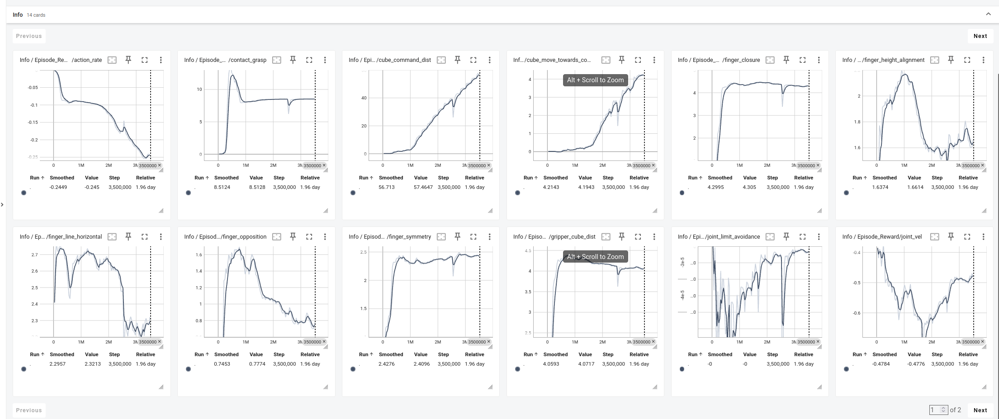
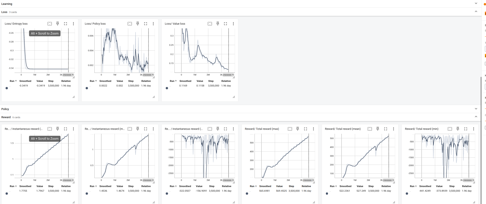
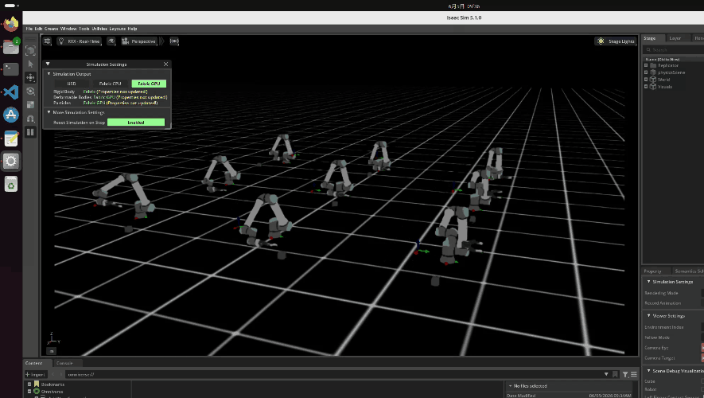
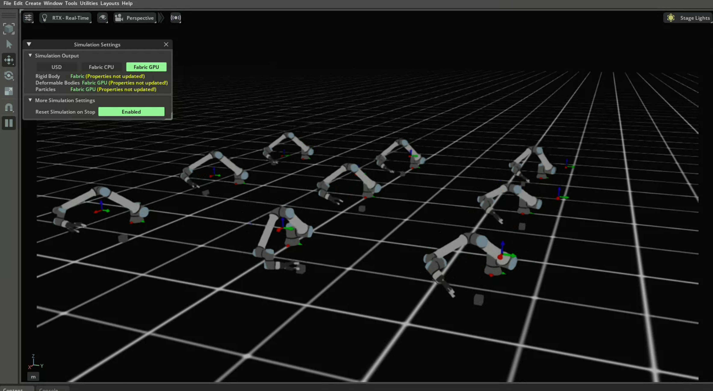
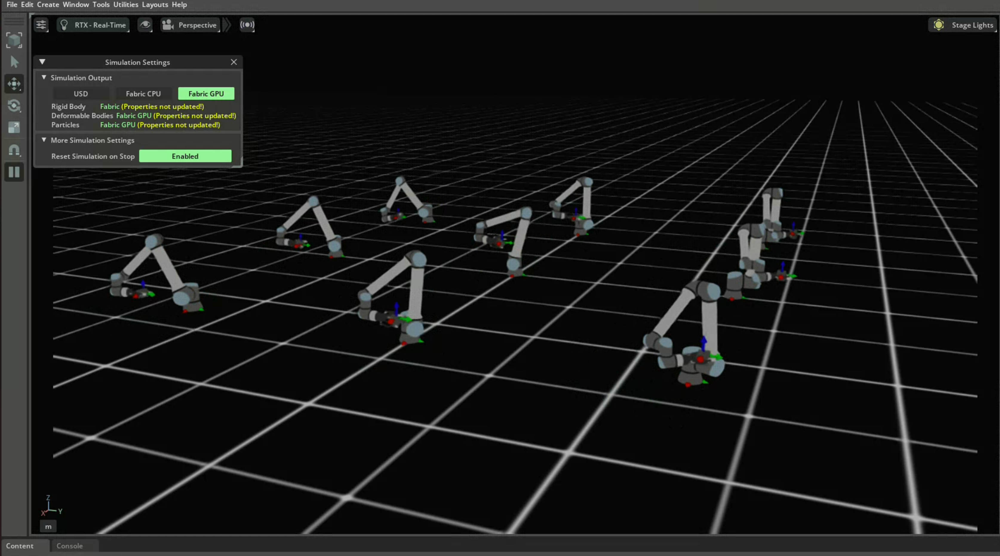

# UR10e Cube Pick & Stabilize (Isaac Lab RL Environment)

This repository contains a reinforcement learning environment built on [NVIDIA Isaac Lab](https://github.com/isaac-sim/IsaacLab) for training a UR10e robotic arm with a Robotiq 2F-140 gripper to grasp and transport a cube to a commanded target. 

**Training Objective:** Learn a control policy that robustly grasps the cube, accurately transports it to a dynamically commanded target, and stably maintains its pose upon arrival.

While the core objective—moving a cube to a target—is inherently **sparse and sequential** (requiring a stable grasp before transportation can begin), this environment employs extensive **reward shaping** to transform the overall signal into a **dense, continuous feedback loop**. This design ensures stable policy learning across the approach, grasp, and transport phases.

## 🛠️ Training Setup & Algorithm
This project utilizes **Proximal Policy Optimization (PPO)** as the core reinforcement learning algorithm. The environment is built on Isaac Lab's **Manager-Based Workflow**.

To improve policy robustness and bridge the sim-to-real gap, Gaussian noise is injected during training across all observation terms, including joint states, cube poses, end-effector velocities, and finger contact forces.

## 📊 Training Metrics & Policy Evaluation

The trained policy achieves a **~97% rollout success rate** during evaluation via the updated `play` script. Success is defined as bringing the cube within **0.08m** (the length of the cube) of the target position. 

> ⚠️ **Note:** Metrics are currently evaluated on the first trajectory of each environment instance. Subsequent tracking upon automatic environment resets is under investigation due to a minor state-synchronization mismatch.

The following presents the TensorBoard metrics recorded across a comprehensive **5,000,000 steps** training run, alongside live simulation demonstrations (checkpoint loaded at 5,000,000 steps).

The policy successfully generates diverse, adaptive trajectories to transport the cube to the target across parallel environment instances. It effectively handles randomized initial cube positions (`x: 0.35–0.5, y: -0.5–0.5`) and randomized target commands (`x: 0.3–0.5, y: -0.5–0.5, z: 0.1–0.5`), demonstrating robust spatial generalization and high-precision task completion.

#### Tensorboard metrics
Reward metrics:

Loss & total reward metrics:

#### Test demo

#### Test demo snapshots

## 🎯 Reward Design

### 🔹 Core Task Rewards
Three primary functions guide the agent toward the main objective:
1. **Approach Reward**: Distance from the midpoint between the two gripper fingers to the cube center. Encourages the end-effector to close the gap to the object.
2. **Contact/Grasp Reward**: Interaction force measured by contact sensors on both fingers. Incentivizes establishing firm bilateral contact with the cube.
3. **Transport Progress Reward**: Distance from the cube to the commanded target. A **linear + exponential composite function** is used to provide scalable, distance-aware feedback throughout the movement phase.

### Auxiliary Rewards (Mitigating Reward Hacking)
Early training revealed a reward-hacking behavior where the policy pressed down on the cube from an oblique angle instead of properly grasping it. To enforce stable, side-to-side grasping, the following shaping rewards were introduced:
- **Finger Closure**: Encourages reducing the finger gap as the gripper approaches the cube.
- **Horizontal Alignment**: Encourages the fingers to align horizontally and grasp the cube from both sides.
- **Wrist Orientation**: Encourages aligning the gripper wrist's approach direction toward the cube center.

### Penalties
- **Joint Limit Penalty**: Applied when joints approach their soft/hard limits, as performance degradation was observed near these boundaries.

## 📚 Curriculum Learning
The training schedule progressively increases task complexity to stabilize learning:
- **150k Steps**: Gradually increase the contact/grasp reward weight. The policy learns to securely grasp the cube after initial contact.
- **200k Steps**: Gradually increase the cube-to-target distance reward. The policy transitions from grasping to active transportation.
- **Progressive Alignment**: Gradually increase the reward for aligning the cube's velocity vector with the target direction, accelerating convergence during the transport phase.

## ⚙️ Additional Implementation Details
- **Success Rate Evaluation**: Built-in logic within the `play` script monitors rollout steps, calculating and logging real-time success percentages across inference trials.
- **Spatial Transformations**: Finger link centers are computed using spatial transforms for precise geometric grasp rewards.
- **Actuator Tuning**: Active joint `stiffness`/`damping` and mimic joint `natural frequency`/`damping ratios` are carefully calibrated to balance responsiveness and simulation stability.
- **Physics Solver**: Solver position/velocity iterations set to `32` for robust contact handling.

## 📋 TODO
- [x] Add a stabilization reward to maintain the cube's position after reaching the target.
- [x] Compute and log rollout success rates in the `play` script.
- [ ] Increase the randomization range for initial cube and target positions to improve generalization.
